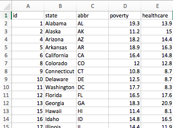

# Data Journalism and D3

<a target='_blank' href="https://giphy.com/gifs/newspaper-press-v2xIous7mnEYg">  <em>via GIPHY</em></a>

## Background

In this project, I have analyzed the current trends shaping people's lives using D3. 

#### 1. Finding the Data

Look for demographic information using the 2014 one-year estimates from the U.S. Census Bureau's American Community Survey. Found the required information using the [American FactFinder](http://factfinder.census.gov/faces/nav/jsf/pages/searchresults.xhtml) tool. When searching through the data, provided the below options for data search:

* Topics -> Dataset -> 2014 ACS 1-year estimates

* Geographies -> Select a geographic type -> State - 040 -> All States within United States and Puerto Rico

Downloaded the 'ACS_14_1YR_S0501' data set. 

Next, searched for the data on health risks using 2014 survey data from the [Behavioral Risk Factor Surveillance System](https://chronicdata.cdc.gov/Behavioral-Risk-Factors/BRFSS-2014-Overall/5ra3-ixqq). Downloaded the whole .csv file and used Excel's filtering tools.

#### 2. Format and Test the Data

Next step is to format the data for D3. 

To make sure there is a solud trend, tested for correlation with Excel's `=CORREL()` function. 

* If you don't find a value that matches, try at least four other demographic-risk combinations—if you can't find one that hits -0.5 or .5, just go with the most striking mix.

Prepared the final file as  `fianl_data.csv` and placed it in the `data` folder.

#### 3. Visualize the Data

Using the D3 created a scatter plot that represents each state with circle elements. Main code for the graphic in the `app.js` 

* The x-values of the circles matches the demographic census data, while the y-values represent the risk data.

* Included state abbreviations in the circles.

* Generated this chart in the `d3.html` file in your assignment directory.

#### 4. Embed into an iframe

The graphic in  `d3.html` dis embedded in the `index.html` with an iframe. 

#### 5. More Data, More Dynamics

Included few more demographics and risks. Placed additional labels in the scatter plot and gave them click events so that  users can decide which data to display. 

#### 6. Incorporate d3-tip

While the ticks on the axes allow us to infer approximate values for each circle, it's impossible to determine the true value without adding another layer of data.  Added tooltips to the circles and displayed each tooltip with the data that the user has selected. 

